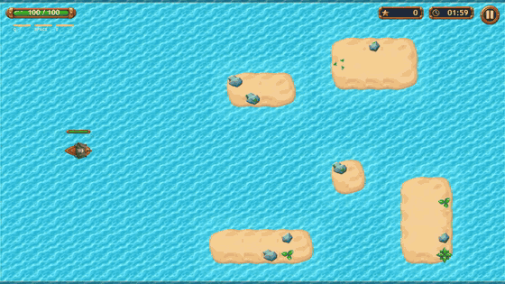
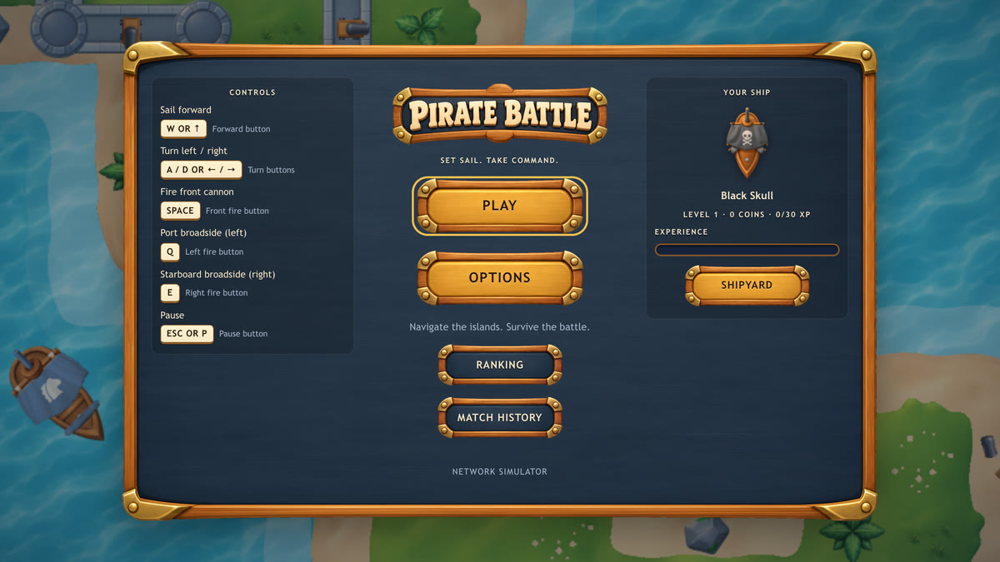
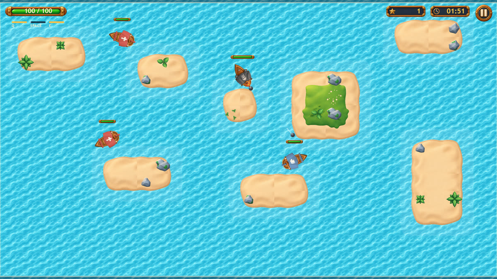
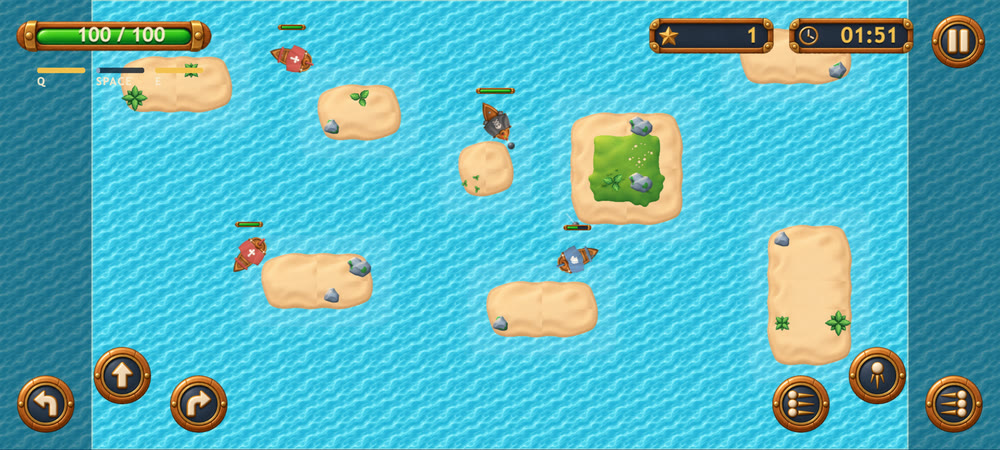

# Pirate Battle

[](https://github.com/daviddanielbp/pirate-battle/actions/workflows/ci.yml)

**English** · [Português](README.pt-BR.md)

A top-down naval shooter that runs in the browser. You sail between islands, sink Chasers and Shooters before the clock runs out, and your best run goes to a ranking. React draws the menus, PixiJS draws the sea, and the battle itself is a plain TypeScript simulation that neither of them owns.

**Play it:** https://pirate-battle-nine.vercel.app



## Context

I built this for a technical challenge from Jungle Gaming in September 2026. The brief, kept unchanged in [docs/CHALLENGE.md](docs/CHALLENGE.md), asked for a complete game on a fixed stack (React, strict TypeScript, PixiJS, TanStack Query, Axios, MSW, Playwright), a mocked ranking API with failure scenarios, accessibility, a performance report and a public deploy. I didn't make it to the final round. The project stays public because it is the most complete front-end work I can show, and because the parts I would do differently are worth writing down (see [What I would change](#what-i-would-change)).

## What is in it

- **Gameplay:** thrust and rotation, a front cannon and two three-shot broadsides, two enemy types (a Chaser that rams you, a Shooter that keeps its distance and fires when it has line of sight), islands that block ships and cannonballs, a new island layout generated from each match's seed, automatic pause when the tab loses focus.
- **Ranking and match history** served by an MSW mock API that also runs in the published build, with 14 network scenarios (slow, jitter, out-of-order, timeout, 4xx/5xx, a submission that times out after being stored, and others). Submissions are idempotent by match id and survive a page refresh.
- **Desktop and mobile:** keyboard, optional mouse steering, touch buttons. In portrait the arena rotates 90° so it stays fully visible.
- **Extras beyond the brief** ([EXTRAS.md](EXTRAS.md)): coins, XP and levels, a Shipyard with hulls, cannons and upgrades, four interface languages. They are opt-in or leave the required rules untouched.

| Menu | Battle | Mobile (landscape, touch) |
| --- | --- | --- |
|  |  |  |

## Technical decisions

**The simulation owns the battle.** `MatchSimulation` ([src/game/core/simulation.ts](src/game/core/simulation.ts)) has no Pixi or React imports. It advances in fixed 1/60 s steps from an accumulator, so movement, cooldowns and spawns don't depend on frame rate, and the same seed with the same inputs produces the same match. Pixi reads the simulation each frame and draws it; React never sees a frame.

**React re-renders about once per second.** The runtime publishes a small HUD snapshot through `useSyncExternalStore` and only notifies when something React shows actually changes (whole seconds, score, health, status). Score, time and health are drawn in the canvas; a visually hidden copy with a polite live region serves screen readers and the tests.

**All balance numbers live in one typed config.** [gameplayConfig.ts](src/game/config/gameplayConfig.ts) holds speeds, damage, cooldowns, spawn rules and ranges. Options and Shipyard upgrades produce a modified copy when a match starts, so changing either never touches a running battle or the systems' code.

**Resource lifecycle is explicit.** One Pixi `Application` per match, destroyed on exit together with the ticker, listeners and pooled sprites. React Strict Mode's double mount is handled by a `disposed` flag checked after the async `init`. Atlases stay cached in `Assets`, so restarting doesn't re-upload textures. After five start/play/leave cycles the JS heap converges around 10.8 MB ([docs/PERFORMANCE.md](docs/PERFORMANCE.md)).

**Submissions go through TanStack Query, not around it.** Each submission runs in a `MutationObserver` scoped to its match id, with a single in-flight promise per id, a pending queue in `localStorage`, and retries on startup and on demand. List queries are cancelled before invalidation, so a late response can't overwrite a newer one.

**Tests drive the real game.** With `?test=1&clock=manual` the app exposes a small test API that presses the same controls a player uses and advances the clock by hand. Playwright uses it to check movement, collisions, damage, cooldowns, spawns, pause and match end deterministically, alongside the UI flows, visual baselines and an axe-core audit.

Longer write-ups: [ARCHITECTURE.md](ARCHITECTURE.md), [SOLUTION.md](SOLUTION.md) (setup, controls, network scenarios, reproducing failures) and [docs/DEVELOPMENT_NOTES.md](docs/DEVELOPMENT_NOTES.md) (how it was built, bugs found in play-testing and review).

## Running it

Requirements: Node.js 20+ and pnpm 10 (`corepack enable` picks the version pinned in `package.json`).

```bash
pnpm install
pnpm dev            # http://localhost:5173
pnpm build          # type-check + production build in dist/
pnpm preview        # serves dist/ on http://localhost:4173
pnpm lint
pnpm typecheck
```

There is no backend and no required environment variable: the mock API runs in the browser. `.env.example` lists the two optional ones.

Controls: `W`/`↑` sail, `A`/`D` or `←`/`→` turn, `Space` front cannon, `Q`/`E` broadsides, `Esc`/`P` pause. Touch buttons show up on touch devices (or with `?touch=1`).

## Tests

```bash
pnpm test:unit                            # Vitest: simulation rules, arena generator, progression
pnpm exec playwright install chromium     # once
pnpm test:e2e                             # builds, serves and runs the Playwright suite
pnpm test:report                          # opens the HTML report
```

| Suite | Size | Where it runs |
| --- | --- | --- |
| Unit (Vitest) | 216 tests in 3 files (200 are one check per arena seed), under 1 s. `pnpm test:unit:coverage` reports coverage for `src/game/core` and progression | CI and locally |
| End-to-end (Playwright) | 202 tests in 17 files: 101 specs × desktop and mobile Chromium, 2 skipped by design (touch-only). About 17 min locally with 3 workers | CI (one job per project) and locally |
| Visual regression | 3 screens × 2 viewports, baselines in `e2e/__screenshots__/` | Locally. The baselines were recorded on macOS and Linux rasterizes fonts and WebGL differently, so CI runs with `--ignore-snapshots` |
| Accessibility | axe-core, WCAG 2.0/2.1 A and AA, every screen and dialog | Inside the Playwright suite |

CI ([.github/workflows/ci.yml](.github/workflows/ci.yml)) runs lint, typecheck, unit tests, build and both Playwright projects, and uploads the HTML report and failure traces as artifacts.

## Numbers

| What | Result |
| --- | --- |
| 3-minute battle, production build, MacBook Air M3, DPR 2 | 60 FPS average, p95 frame time 17.6 ms, peak 11 entities ([report](docs/PERFORMANCE.md)) |
| JS heap after 5 start/play/leave cycles | 9.9 → 10.8 MB, with shrinking increments |
| Lighthouse, deployed build (mobile / desktop) | Performance 79 / 98, Accessibility 94, Best practices 100. With the lazy-loaded battle (below), a local mobile run went from 78–80 to 89 |
| JavaScript before the first screen (gzip) | 291 KB. PixiJS (170 KB) now loads when you press Play instead of on the menu; before that change it was 475 KB. The entry chunk still carries MSW, which a real product wouldn't ship |

## What I would change

- **Too many rules are tested only through the browser.** The simulation is pure and deterministic, yet in the delivery I tested it only through Playwright, one page round-trip at a time; some combat tests take close to a minute. The Vitest specs in `tests/unit/` came later. The better split is most rule checks as unit tests and a thinner E2E layer for UI flows and integration.
- **One day was too little for this scope.** I built it in one long day, with an AI coding assistant writing most first drafts ([DEVELOPMENT_NOTES](docs/DEVELOPMENT_NOTES.md) says so). The extras (Shipyard, languages, random arenas) took time that should have gone into the required parts and into a readable history.
- **The commit history doesn't show the process.** Most commits share one timestamp because I reorganized the history before delivering. Small commits made along the way would have told the story better.
- **Loose ends in the delivery:** the docs pointed to a committed Playwright report that wasn't in the repository, and the asset license notes the brief asked for were missing.

## Project layout

```
src/
  game/core/     simulation, collisions, arena generator, navigation grid, steering (no Pixi)
  game/render/   PixiJS layers: arena, ships, projectiles, effects, HUD
  game/          runtime (fixed-step loop, pause, clock), input, audio, assets, config, progression
  ui/            React UI: atoms / molecules / organisms / templates / pages
  data/          Axios client, contracts, TanStack Query hooks, pending submissions
  mocks/         MSW handlers, fixtures, in-browser database, network scenarios
  storage/       validated localStorage adapters
  testing/       test API and ids shared with Playwright
e2e/             Playwright specs and visual baselines
tests/unit/      Vitest specs
```

## Credits

Game art and sound effects came with the challenge brief (`assets/`); `pnpm assets:build` packs them into the atlases and audio in `public/assets/`. Code by David Daniel.
